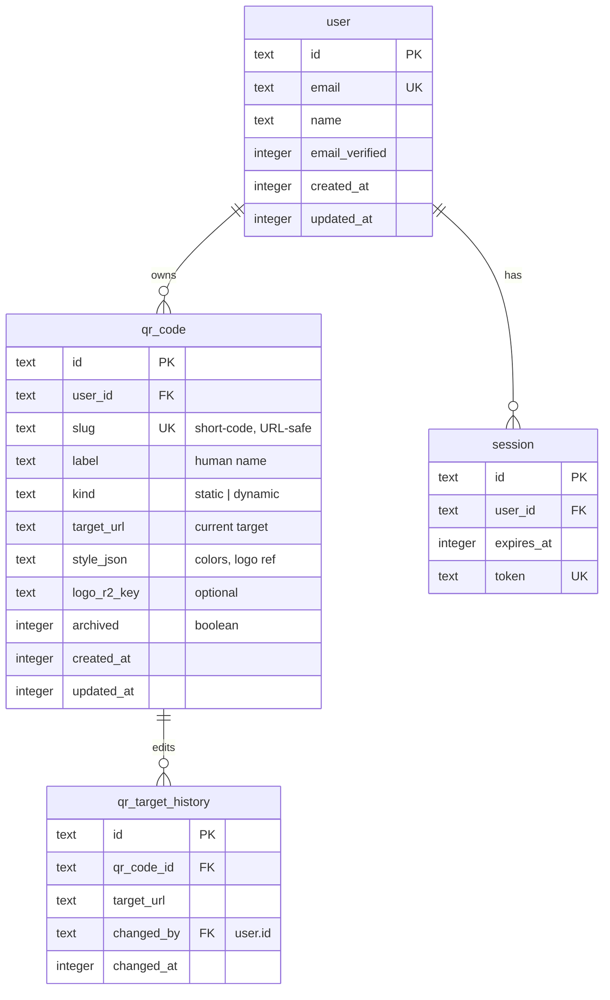

# Scanimal QR Manager — Foundation (Auth, Dashboard, Cloudflare Template)

## Overview

Scanimal is a multi-tenant QR code manager built as a reusable, templated Cloudflare
Workers application. This plan lays the foundation: wiring WebAwesome as the UI system,
promoting the scaffolded better-auth demo into real sign-in / sign-up / forgot-password
pages, shipping an authenticated dashboard shell, introducing the core QR data model,
and making the entire Cloudflare footprint (D1, KV, R2, Analytics Engine) reproducible
from a single setup script so the repo can be cloned into any Cloudflare account and
be live in minutes.

The product itself is a lightweight competitor to services like Uniqode / QRCode Monkey /
Bitly-for-QR: users sign in, create short codes (static or dynamic), render QR images,
edit the target URL without regenerating the QR, and see scan analytics. The Cloudflare
edge is the critical performance advantage — redirects resolve in single-digit ms
globally from KV, with D1 as source of truth and Workers Analytics Engine recording
scan events.

## Problem Statement

Current repo state (`main`, commit `2c159e6`):

- SvelteKit 2 + Svelte 5 runes, Cloudflare adapter, D1 bound as `DB`.
- `better-auth` 1.4.21 wired in `src/lib/server/auth.ts` and `src/hooks.server.ts`.
- `@awesome.me/webawesome@3.5.0` installed but **not imported anywhere** — no CSS, no
  components registered.
- Auth lives under `src/routes/demo/better-auth/*` with ugly unstyled forms.
- A stray `task` table sits in `src/lib/server/db/schema.ts` with no corresponding
  feature — likely scaffolding leftover.
- `wrangler.jsonc` hardcodes `database_id` — not templatable.
- No KV, R2, Analytics Engine, or Queues bindings yet.
- No domain tables for QR codes, scans, or redirect history.
- No `.env` documentation for the auth secret format; the `.env` already contains
  values but is gitignored.

We need to replace the demo skeleton with a real auth/dashboard surface, add the QR
domain model, carve a fast-path redirect, and turn the whole thing into a clonable
template for other Cloudflare accounts.

## Proposed Solution

Ship in four phases. Phase 1 lands the shell (WebAwesome, auth, dashboard, template
plumbing) — the user explicitly asked to "get rolling" on this. Phase 2 adds the QR
domain. Phase 3 layers analytics. Phase 4 polishes the template and write-once setup.

Key architectural bets:

1. **KV for the redirect hot path** — short-code → target URL is read thousands of
   times per write. D1 is source of truth; KV is a projection purged on edit.
2. **Workers Analytics Engine for scans** — append-only event stream, SQL aggregation
   on the dashboard, zero operational burden. DO counters considered and rejected
   for v1 (see "Alternatives").
3. **WebAwesome autoloader** — import CSS globally once in `+layout.svelte`; lazy-load
   components via the autoloader so bundle size stays small.
4. **`wrangler.template.jsonc`** — checked-in template with placeholders; a
   `scripts/bootstrap.sh` creates D1/KV/R2 on a fresh Cloudflare account and writes
   the concrete `wrangler.jsonc`. Keeps the repo cloneable without leaking account IDs.
5. **Route guard in `hooks.server.ts`** — `/dashboard/*` and `/api/private/*` redirect
   to `/login` when no session; everything else (including `/s/[slug]`) stays public.

## Technical Approach

### Architecture

```mermaid
flowchart LR
  subgraph Client
    B[Browser / Mobile scanner]
  end

  subgraph Edge[Cloudflare Worker — SvelteKit]
    H[hooks.server.ts<br/>auth + guard]
    RD[/s/slug redirect]
    AUTH[/login /register<br/>/forgot-password]
    DASH[/dashboard/*]
    API[/api/qr/*]
  end

  subgraph Data[Cloudflare primitives]
    D1[(D1: users, qr_code,<br/>qr_target, qr_target_history)]
    KV[[KV: QR_LOOKUP<br/>slug→target]]
    R2[[R2: QR_ASSETS<br/>logos, exports]]
    AE[(Analytics Engine:<br/>qr_scan_events)]
  end

  B -- scan QR --> RD
  RD -- O(1) read --> KV
  RD -- fire and forget --> AE
  RD --> B

  B -- login --> AUTH
  AUTH -- session --> H
  H --> DASH
  DASH --> API
  API -- write --> D1
  API -- dual write --> KV
  API -- upload --> R2
  DASH -- SQL --> AE
```

### Data model



Scan events are NOT in D1 — they go to Analytics Engine. This keeps scan ingest
cheap and avoids D1 row-count pressure from high-volume public traffic.

### Implementation Phases

#### Phase 1 — Foundation (this PR)

Land the shell end-to-end so the dashboard is usable and the repo is templatable.

Deliverables:

- [ ] **Remove demo skeleton:** delete `src/routes/demo/**` and the `task` table in
      `src/lib/server/db/schema.ts`.
- [ ] **WebAwesome globals:** import `@awesome.me/webawesome/dist/styles/webawesome.css`
      and the autoloader in `src/routes/+layout.svelte`; document a
      `src/lib/wa.ts` shim that lists the components actually used so tree-shaking
      still wins.
- [ ] **Theming:** add a light/dark CSS toggle stored in a cookie; respect
      `prefers-color-scheme` on first load.
- [ ] **Auth pages:** new routes `src/routes/(auth)/login/+page.svelte`,
      `/register/+page.svelte`, `/forgot-password/+page.svelte`,
      `/verify-email/+page.svelte`. Use `<wa-input>`, `<wa-button>`,
      `<wa-callout>` for errors; keep progressive enhancement via `<form method="post">`.
- [ ] **Auth server logic:** move the existing signin/signup actions into the new
      `(auth)` group and delete the demo copies. Keep `APIError` handling and
      `fail(400, { message })`.
- [ ] **Route guards:** in `src/hooks.server.ts`, add a sequence of handlers —
      `handleAuth` then `handleRouteGuard`. Guard redirects `/dashboard/*` to
      `/login?next=<path>` if no session.
- [ ] **Dashboard shell:** `src/routes/(app)/+layout.svelte` with `<wa-page>` sidebar
      (My QR Codes, Settings, Sign out) and topbar (workspace switcher placeholder,
      avatar dropdown). `src/routes/(app)/dashboard/+page.svelte` as the landing
      after login.
- [ ] **Forgot-password stub:** page renders and submits; better-auth's
      `forgetPassword` is called but email delivery is stubbed (see Phase 3 for
      Workers Email wiring). Return a "check your email" state even on unknown email
      to avoid user enumeration.
- [ ] **Template plumbing:**
  - `wrangler.template.jsonc` — placeholders `{{D1_DATABASE_ID}}`, `{{KV_NAMESPACE_ID}}`,
    `{{R2_BUCKET_NAME}}`, `{{ACCOUNT_ID}}`.
  - `scripts/bootstrap.sh` — idempotent: runs `wrangler d1 create scanimal-db`,
    `wrangler kv namespace create QR_LOOKUP`, `wrangler r2 bucket create scanimal-assets`,
    captures returned IDs, `sed`s them into `wrangler.jsonc`. Writes
    `.env.local` with generated `BETTER_AUTH_SECRET` (`openssl rand -base64 32`).
  - `wrangler.jsonc` added to `.gitignore`; `wrangler.template.jsonc` checked in.
  - `.env.example` updated with all required vars; add a note explaining which are
    secrets (wrangler secret put) vs plain env vars.
- [ ] **CLAUDE.md update:** add a "Bootstrap for a new Cloudflare account" section
      pointing at `scripts/bootstrap.sh`.
- [ ] **Tests:** vitest covers `generateSlug()` uniqueness/charset and the auth
      guard's redirect logic.

Success criteria:

- `pnpm install && ./scripts/bootstrap.sh && pnpm run dev` takes a clean clone to a
  working login screen in under 3 minutes on a fresh Cloudflare account.
- Signing up creates a user, signs them in, redirects to `/dashboard`.
- Hitting `/dashboard` while logged out redirects to `/login?next=/dashboard`.
- `pnpm check` clean (wrangler types regenerated after new bindings).

Estimated effort: 1–2 focused days.

#### Phase 2 — QR domain core

Deliverables:

- [ ] **Schema:** new tables `qr_code`, `qr_target_history` in
      `src/lib/server/db/schema.ts`. Drizzle migration via `pnpm db:generate`.
- [ ] **Slug generation:** `src/lib/server/qr/slug.ts` — 7-char base62, collision
      check against D1, retry up to N times, then fall back to 8 chars.
- [ ] **Create flow:** `src/routes/(app)/dashboard/qr/new/+page.svelte` — form
      with label, target URL, optional custom slug. Server action `createQrCode`:
  1. Validate URL.
  2. Insert into D1.
  3. Write slug→target into KV (`QR_LOOKUP`).
  4. Redirect to `/dashboard/qr/[id]`.
- [ ] **List page:** `src/routes/(app)/dashboard/qr/+page.svelte` — table of the
      user's QR codes (`<wa-card>` grid on mobile, table on desktop).
- [ ] **Detail page:** `src/routes/(app)/dashboard/qr/[id]/+page.svelte` — preview
      the rendered QR (`qr-creator` or similar, see "Dependencies"), edit target,
      archive, copy short URL.
- [ ] **Edit-target flow:** updates D1, appends to `qr_target_history`, purges
      KV key, re-writes it. Transactional semantics: if KV write fails, log and
      retry from a queue (Phase 3 adds the retry; v1 swallows the error with a
      user-visible banner and a "resync KV" button).
- [ ] **Public redirect:** `src/routes/s/[slug]/+server.ts` — pure Worker handler,
      not a page:
  1. Read slug from KV. Miss → read D1, backfill KV, continue.
  2. `waitUntil(writeAnalyticsEvent(event))` — fire-and-forget scan record.
  3. Return `302` to target.
- [ ] **QR image rendering:** client-side via a small lib (candidate:
      `qr-creator`, 4kb, MIT). Download buttons for PNG and SVG. No server-side
      render yet — that's Phase 4 if needed.
- [ ] **Tests:** vitest + MSW for slug collision, target edit purging KV,
      redirect cache behavior.

Success criteria:

- Create a QR, scan it from a phone, land on the target in <150ms from a cold edge.
- Edit the target; next scan hits the new URL within ~60s (KV propagation).
- `qr_target_history` grows by one row per edit.

#### Phase 3 — Analytics & email

Deliverables:

- [ ] **Analytics Engine binding** (`SCAN_EVENTS`) + the scan-writer in
      `/s/[slug]`. Fields: `blobs: [slug, country, userAgent]`, `doubles: [1]`,
      `indexes: [userId]` so per-owner queries are fast.
- [ ] **Dashboard charts:** `src/routes/(app)/dashboard/qr/[id]/+page.svelte` fetches
      a 30-day SQL API query, renders a sparkline via a minimal lib
      (candidate: `uplot`, ~40kb).
- [ ] **Queues** for dead-letter KV resync: if the target-edit worker fails to
      update KV, enqueue a retry. One consumer Worker.
- [ ] **Email delivery:** better-auth's email hooks routed through Cloudflare
      Email Workers → Resend (or plain SMTP via MailChannels replacement). Put the
      provider behind `src/lib/server/email.ts` so the template can swap providers.
- [ ] **Turnstile** on `/register` and `/forgot-password`.

#### Phase 4 — Template polish

Deliverables:

- [ ] **`scripts/bootstrap.sh` v2:** interactive prompt for project name, detects
      existing resources, supports `--non-interactive` with env vars for CI.
- [ ] **GitHub Action** — `deploy.yml` using `cloudflare/wrangler-action`. Uses
      repo secrets for `CLOUDFLARE_API_TOKEN` and `BETTER_AUTH_SECRET`.
- [ ] **Docs:** `docs/TEMPLATE.md` — how to fork this repo into a new Cloudflare
      account, including Turnstile site-key and Analytics Engine dataset setup.
- [ ] **Readme overhaul:** replace the default sv scaffolding README.
- [ ] **Seed data:** `scripts/seed.ts` inserts one demo user + three QR codes so
      a fresh clone is not empty on first login.

## Alternative Approaches Considered

1. **Durable Objects per QR code for live counters.**
   - *Pro:* Strongly consistent scan counts, real-time dashboards, no SQL-API
     eventual-read delay.
   - *Con:* DO invocations + storage cost more than Analytics Engine, add a
     per-QR cold-start hop on the redirect path, and complicate multi-region
     routing. Defer; revisit if users ask for real-time counters.
2. **KV only (no D1) for targets.**
   - *Pro:* One fewer service.
   - *Con:* KV is eventually consistent. Editing targets from the dashboard with
     a "did my edit take?" UX becomes awkward. We want D1 as source of truth.
3. **Server-side QR rendering via a Worker endpoint.**
   - *Pro:* Canonical PNG URL usable in emails and print.
   - *Con:* Adds a dependency on a QR lib that works in Workers (most use
     `canvas`). Defer to Phase 4 if demand exists; client-side download covers
     the common case.
4. **Keep auth at `/demo/better-auth/*`.**
   - *Con:* Ugly paths, unclear to users, skinned with no styling. Rejected.
5. **Supabase / Clerk instead of better-auth.**
   - *Con:* User explicitly wants better-auth; it also keeps all state inside the
     Cloudflare account, which simplifies the template story.
6. **Store scan events in D1.**
   - *Con:* D1 row count and write throughput would dominate the cost model at
     even modest scan volume. Analytics Engine is designed exactly for this.

## System-Wide Impact

### Interaction graph

- **Login form → `signInEmail` action → `auth.api.signInEmail` →** better-auth
  writes `session` row in D1, sets cookie via `sveltekitCookies` plugin →
  `hooks.server.ts` on next request reads the cookie, loads `locals.user` →
  guard lets `/dashboard/*` through.
- **Create QR → `createQrCode` action →** insert D1 `qr_code` + insert
  `qr_target_history` first row + `KV.put(slug, target)` → redirect to detail.
- **Scan → `/s/[slug]` →** `KV.get(slug)` → on miss `DB.select().from(qr_code)`
  + `KV.put` backfill → `event.platform.ctx.waitUntil(writeAnalyticsEvent())` →
  `302`. Response never blocks on the analytics write.
- **Edit target → `updateTarget` action →** D1 update + history insert + `KV.put`.
  A failure between D1 and KV leaves the old target live in KV; we surface this
  as a toast and (Phase 3) enqueue a Queue retry.

### Error & failure propagation

- `APIError` from better-auth → `fail(400, { message })` in form actions →
  rendered into `<wa-callout variant="danger">`.
- `KV.put` failure post-D1 write: logged, user sees "saved, sync pending" banner,
  cron + Queues retry in Phase 3. Until Phase 3, a "Resync" button re-runs the
  put.
- Analytics Engine write failure: silent; we do not block the scan response.
  Observed via CF dashboard.
- Missing slug on `/s/[slug]`: `404` with a branded page, not a redirect loop.

### State lifecycle risks

- **Orphan KV keys:** archiving or deleting a `qr_code` must delete its KV entry,
  else scans still redirect. Handled in the delete/archive action.
- **Duplicate slugs:** enforced by D1 unique index on `slug`. Slug generator
  retries on `UNIQUE` constraint error.
- **Session vs user rows:** `onDelete: cascade` already set on `session.userId`
  and `account.userId` — deleting a user cleans those. `qr_code.userId` gets the
  same cascade.
- **Stale auth state in `locals`:** `hooks.server.ts` reads the session every
  request via better-auth; cookie rotation handled by the plugin.

### API surface parity

- All mutations that write to D1 AND KV (`createQrCode`, `updateTarget`,
  `archiveQrCode`, `deleteQrCode`) must go through a single `src/lib/server/qr/mutations.ts`
  module. No route should call `DB.insert` or `KV.put` directly — prevents drift
  between the two stores.
- Any future REST or MCP endpoints expose the same mutation module, so the
  D1/KV dual-write invariant holds across entry points.

### Integration test scenarios

1. **Edit target + scan:** create QR, scan redirects to A, edit to B, wait 60s,
   scan redirects to B. Confirms KV purge.
2. **KV miss backfill:** clear KV manually, scan, confirm KV is repopulated
   from D1 and redirect succeeds on first request.
3. **Unauthenticated dashboard:** `/dashboard/qr` with no cookie → 302 to
   `/login?next=/dashboard/qr`. Log in → bounce to `/dashboard/qr`.
4. **Cross-user isolation:** user A creates QR; user B cannot read, edit,
   or delete it via `/dashboard/qr/[id]` or the redirect edit endpoints.
5. **Slug collision:** seed D1 with a slug that the generator would produce;
   confirm generator retries and eventually succeeds.

## Acceptance Criteria

### Functional

- [ ] Fresh clone: `pnpm install && ./scripts/bootstrap.sh && pnpm dev` works on
      any Cloudflare account with a valid API token.
- [ ] `/register` creates a user, sends them to `/dashboard`.
- [ ] `/login` works; bad credentials show a `<wa-callout variant="danger">`
      with the error message.
- [ ] `/forgot-password` accepts an email and returns a neutral "check your
      inbox" state regardless of whether the email exists.
- [ ] `/dashboard/*` requires a session.
- [ ] `/dashboard/qr/new` creates a QR and routes to the detail page.
- [ ] `/dashboard/qr` lists only the signed-in user's QRs.
- [ ] `/dashboard/qr/[id]` shows a rendered QR, the short URL, and an editable
      target.
- [ ] Editing a target appends to `qr_target_history` and purges/rewrites KV.
- [ ] `/s/[slug]` redirects to the current target.
- [ ] Signing out clears the cookie and returns to `/login`.

### Non-functional

- [ ] `/s/[slug]` P50 latency < 30ms at the edge (KV hit path).
- [ ] No D1 query in the redirect hot path on KV hit.
- [ ] All authenticated pages render with WebAwesome components, not raw HTML.
- [ ] `pnpm check` and `pnpm test` both pass on CI.
- [ ] No secrets committed; `wrangler.jsonc` is gitignored in favor of the
      template.

### Quality gates

- [ ] `generateSlug` has a vitest covering uniqueness and charset.
- [ ] Route guard has a test.
- [ ] `createQrCode` / `updateTarget` / `archiveQrCode` each have a test that
      verifies both D1 and KV are written/purged.
- [ ] README explains bootstrap in ≤10 steps.
- [ ] `ce:ce-review` pass before merge.

## Success Metrics

- Time from `git clone` to logged-in dashboard on a fresh Cloudflare account:
  **≤ 3 minutes**.
- Scan-to-redirect P50 latency globally: **≤ 30ms**.
- Weekly active users / total users ratio: instrumented via Analytics Engine,
  target > 40% after launch.
- Zero drift between D1 and KV over a 7-day production run (monitored by a
  reconciliation cron in Phase 3).

## Dependencies & Prerequisites

- Cloudflare account with Workers Paid plan (Analytics Engine + Queues require it
  in Phase 3; Phase 1 works on Free).
- `CLOUDFLARE_API_TOKEN` with D1/KV/R2/Workers write scopes.
- `BETTER_AUTH_SECRET` — generated during bootstrap.
- Node 20+, pnpm 9+, wrangler 4.84+.
- (Phase 3) Resend or MailChannels account for outbound email.
- (Phase 3) Turnstile site+secret key.

New runtime dependencies expected:

- `qr-creator` (~4kb, MIT) — client-side QR rendering.
- `uplot` (~40kb, MIT) — sparkline charts (Phase 3).
- Optional: `zod` or `valibot` for form input validation (pick valibot for size).

## Risk Analysis & Mitigation

| Risk | Likelihood | Impact | Mitigation |
|---|---|---|---|
| KV eventual consistency confuses users editing targets | M | M | Surface a "propagation window: up to 60s" hint near the target input; Phase 3 Queues retry + reconciliation. |
| WebAwesome SSR hydration mismatch (custom elements) | M | M | Import styles/autoloader in layout `<script>`, not at module top-level; test a page in preview build, not just dev. |
| `wrangler.jsonc` gitignore strategy confuses users | L | M | Bootstrap script is explicit: prints the resolved config and the file it wrote; docs emphasize never committing it. |
| better-auth secret rotation story | L | H | Bootstrap writes to `.env.local`; document `wrangler secret put BETTER_AUTH_SECRET` for production. |
| Analytics Engine SQL quota | L | M | Queries are cached at the edge via `cache: 'force-cache'` with short TTL in Phase 3. |
| Slug collisions at scale | L | L | 7-char base62 = 3.5T keyspace; retry logic in `generateSlug`. |
| Demo scaffolding deletion breaks something subtle | L | L | Do it in one commit; run full `pnpm check && pnpm test` after. |

## Resource Requirements

- 1 engineer, ~1–2 days for Phase 1.
- ~2 days Phase 2, ~2 days Phase 3, ~1 day Phase 4.
- No design resource required — WebAwesome ships a credible default look; revisit
  branding post-v1.

## Future Considerations

- **Workspaces / multi-tenant orgs:** add `organization` + `organization_member`
  tables so a single account can invite collaborators per workspace. The
  `qr_code.user_id` becomes `qr_code.organization_id`.
- **Custom domains:** users bring their own domain for short URLs via
  Cloudflare for SaaS.
- **Agent-native API:** MCP server at `/mcp` exposing `create_qr`, `update_target`,
  `list_scans` tools — matches the repo's `mcp` add-on and the agent-native
  parity goals.
- **Dynamic QR content types:** vCard, WiFi, UPI, not just URL.
- **Bulk import/export** for marketing teams.
- **Styled QR rendering server-side** for branded emails and PDFs.

## Documentation Plan

- [ ] `README.md` replaces the default `sv` scaffold text.
- [ ] `docs/TEMPLATE.md` — detailed bootstrap walkthrough with screenshots.
- [ ] `CLAUDE.md` — add "Bootstrap" + "QR domain mental model" sections so
      future agent sessions pick up context fast.
- [ ] Inline JSDoc on `src/lib/server/qr/mutations.ts` explaining the D1/KV
      invariant.

## Sources & References

### Internal references

- `src/lib/server/auth.ts:17-20` — `createAuth(d1)` factory pattern we extend.
- `src/hooks.server.ts:6-20` — existing auth handler we build route guards on.
- `src/lib/server/db/schema.ts` — add QR tables here; delete `task`.
- `src/lib/server/db/auth.schema.ts` — untouched; source of truth for auth
  tables per better-auth CLI.
- `wrangler.jsonc` — replaced by `wrangler.template.jsonc` + gitignore.
- `src/routes/demo/better-auth/**` — delete entirely, migrate actions.

### External references

- WebAwesome — [Svelte setup](https://github.com/shoelace-style/webawesome/blob/next/packages/webawesome/docs/docs/frameworks/svelte.md),
  [usage / autoloader](https://github.com/shoelace-style/webawesome/blob/next/packages/webawesome/docs/docs/usage.md)
- better-auth — [SvelteKit integration](https://www.better-auth.com/docs/integrations/svelte-kit),
  [forgetPassword flow](https://www.better-auth.com/docs/authentication/email-password#forget-password)
- Cloudflare — [D1](https://developers.cloudflare.com/d1/),
  [Workers KV](https://developers.cloudflare.com/kv/),
  [Workers Analytics Engine](https://developers.cloudflare.com/analytics/analytics-engine/),
  [R2](https://developers.cloudflare.com/r2/),
  [Queues](https://developers.cloudflare.com/queues/),
  [Turnstile](https://developers.cloudflare.com/turnstile/)
- Drizzle ORM — [D1 HTTP driver](https://orm.drizzle.team/docs/connect-cloudflare-d1)
- SvelteKit — [route groups `(auth)` / `(app)`](https://svelte.dev/docs/kit/advanced-routing#Advanced-layouts),
  [hooks sequence](https://svelte.dev/docs/kit/@sveltejs-kit-hooks#sequence)

### Related work

- None — this is the foundation commit.
